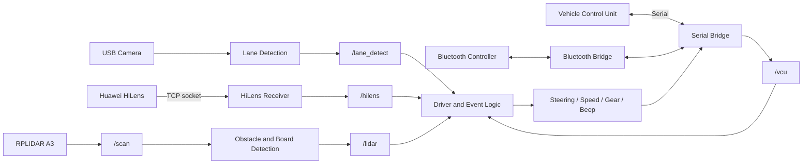

# Huawei Unmanned Car Competition

An experimental autonomous racing car stack built around ROS 1, Huawei
HiLens, monocular lane detection, YOLO-based object detection, an RPLIDAR,
Bluetooth remote control, and a serial vehicle control unit (VCU).

This repository contains the software used to connect perception modules to
vehicle control logic for a small competition car. It also includes offline
computer-vision experiments, network video utilities, recorded test data, and
the RPLIDAR ROS driver.

> [!WARNING]
> This project can command physical steering, throttle, gears, and a buzzer.
> Test with the driven wheels lifted, the vehicle secured, and an emergency
> stop available. Review all hard-coded ports, IP addresses, camera parameters,
> and control limits before running anything on hardware.

## Features

- Lane detection using camera calibration, perspective transformation,
  thresholding, sliding windows, and polynomial fitting.
- Object detection on Huawei HiLens using bundled Ascend `.om` models.
- RPLIDAR-based obstacle and side-board detection.
- Serial communication with the vehicle control unit.
- Bluetooth remote control and telemetry forwarding.
- Event-oriented driving strategies for lane following, traffic lights,
  pedestrians, speed signs, bridges, obstacles, and turning signs.
- Standalone scripts for video streaming, recording, calibration, and offline
  perception testing.

## System Architecture



## Repository Layout

| Path | Purpose |
| --- | --- |
| `Ros/auto_driver/` | Vehicle API, lane node, controllers, and driving events |
| `Ros/bluetooth_bridge/` | Bluetooth, serial, socket bridges, and custom ROS messages |
| `Ros/rplidar_ros/` | RPLIDAR driver plus obstacle and board detection |
| `Hilens/Skill_Detect/` | HiLens lane and object detection skill |
| `Hilens/Skill_GetVideo/` | HiLens camera streaming example |
| `laneDetect/` | Offline lane-detection experiments and test videos |
| `objectDetect/` | HiLens object-detection template and preprocessing tools |
| `socket/` | NumPy/OpenCV socket streaming examples |
| `doc/` | Additional control notes |

## Technology Stack

- ROS 1 and catkin
- Python 2-era ROS nodes and Python 3.7 HiLens scripts
- OpenCV, NumPy, Matplotlib, and pySerial
- PyBluez/RFCOMM
- Huawei HiLens SDK and Ascend offline models
- Slamtec RPLIDAR ROS SDK

The original environment is not fully pinned. Several ROS nodes use Python 2
syntax, so a ROS 1 distribution that still supports Python 2 is the most
compatible starting point. Porting to a Python 3 ROS environment will require
code changes.

## Hardware Assumptions

The checked-in configuration expects:

- A Linux-based ROS computer on the car.
- A serial VCU at `/dev/ttyUSB0`, running at `1,000,000` baud.
- An RPLIDAR A3 at `/dev/ttyUSB1`, running at `256,000` baud.
- A camera exposed as `/dev/video10`.
- A Huawei HiLens device reachable over the same network.
- An RFCOMM Bluetooth controller using channel `22`.

Device names and network addresses are installation-specific and must be
verified before launch.

## Installation

### 1. Clone the repository

```bash
git clone https://github.com/ZheZhang-ovo/Huawei-Unmanned-Car-Competition.git
cd Huawei-Unmanned-Car-Competition
```

### 2. Install runtime dependencies

Install ROS 1 with catkin and the ROS packages used by this project:

- `rospy`
- `roscpp`
- `std_msgs`
- `sensor_msgs`
- `geometry_msgs`
- `message_generation`
- `message_runtime`

Install the matching Python packages for your ROS environment:

- OpenCV
- NumPy
- Matplotlib
- pySerial
- PyBluez

Huawei HiLens scripts must be deployed in a HiLens runtime with the `hilens`
Python module available. The `.om` model files are hardware-specific and do
not run as ordinary desktop Python models.

### 3. Build the ROS workspace

The helper script copies the three ROS packages into `~/fantasy_ws`, makes the
Python nodes executable, runs `catkin_make`, and updates `.bashrc`.

> [!CAUTION]
> `Ros/setup.sh` starts by deleting `~/fantasy_ws`. Back up that directory or
> use the manual procedure below if it contains other work.

Automated setup:

```bash
cd Ros
bash setup.sh
source ~/fantasy_ws/devel/setup.bash
```

Safer manual setup:

```bash
mkdir -p ~/fantasy_ws/src
cp -r Ros/auto_driver Ros/bluetooth_bridge Ros/rplidar_ros ~/fantasy_ws/src/
chmod +x ~/fantasy_ws/src/auto_driver/src/*.py
chmod +x ~/fantasy_ws/src/bluetooth_bridge/src/*.py
chmod +x ~/fantasy_ws/src/rplidar_ros/src/*.py
cd ~/fantasy_ws
catkin_make
source devel/setup.bash
```

## Configuration

Review these values before running the stack:

| Setting | Current location | Checked-in value |
| --- | --- | --- |
| VCU serial port | `Ros/bluetooth_bridge/src/serial_node.py` | `/dev/ttyUSB0` |
| VCU baud rate | `Ros/bluetooth_bridge/src/serial_node.py` | `1000000` |
| RPLIDAR port | `Ros/bluetooth_bridge/launch/base.launch` | `/dev/ttyUSB1` |
| RPLIDAR baud rate | `Ros/bluetooth_bridge/launch/base.launch` | `256000` |
| Camera device | `Ros/auto_driver/src/cap_init.py` | `/dev/video10` |
| HiLens receiver | `Ros/bluetooth_bridge/src/hilens_receiver.py` | `192.168.2.111:7778` |
| HiLens detector sender | `Hilens/Skill_Detect/index.py` | `192.168.2.1:9999` |
| Bluetooth RFCOMM channel | `Ros/bluetooth_bridge/src/bluetooth_node.py` | `22` |

The HiLens sender and ROS receiver must use compatible addresses and the same
port. Camera calibration matrices, perspective-transform points, thresholds,
and model labels must also be recalibrated for the installed camera and track.

## Running the ROS Stack

Source the workspace in every terminal:

```bash
source ~/fantasy_ws/devel/setup.bash
```

Start the base hardware and perception nodes:

```bash
roslaunch bluetooth_bridge base.launch
```

`base.launch` starts:

- the Bluetooth bridge;
- the VCU serial bridge;
- the HiLens socket receiver;
- the lane-detection node;
- the RPLIDAR driver;
- the lidar obstacle/board detector.

### Manual control helpers

Load the shell helpers:

```bash
source Ros/cmd.sh
```

Then publish one-shot commands:

```bash
set-speed 0
set-direct 50
set-mode 3
```

Control ranges:

| Command | Range | Meaning |
| --- | --- | --- |
| Direction | `0..100` | Steering command; `50` is intended as center |
| Speed | `0..100` | Motor command |
| Mode | `1..4` | `1=D`, `2=N`, `3=P`, `4=R` |
| Beep | `0..1` | Buzzer off/on |

### Autonomous controller

The event controller is located at `Ros/auto_driver/src/main.py`. The
checked-in file is not ready to run unchanged: its first event list references
events that are not initialized, even though a later line selects lane
following only. Correct the event configuration, then validate all speed and
gear settings before starting it:

```bash
rosrun auto_driver main.py
```

Do not use `driver_node.py` as a harmless demo. It contains a hard-coded
hardware test sequence that changes steering, applies speed `100`, sounds the
buzzer, and changes gear.

## Main ROS Interfaces

| Topic | Message | Direction | Description |
| --- | --- | --- | --- |
| `/auto_driver/send/direction` | `std_msgs/Int32` | Driver to VCU | Steering command |
| `/auto_driver/send/speed` | `std_msgs/Int32` | Driver to VCU | Speed command |
| `/auto_driver/send/mode` | `std_msgs/Int32` | Driver to VCU | Gear command used by `serial_node.py` |
| `/auto_driver/send/beep` | `std_msgs/Int32` | Driver to VCU | Buzzer command |
| `/vcu` | `bluetooth_bridge/Sensors` | VCU to driver | Motor, IMU, ultrasonic, battery, and temperature data |
| `/lane_detect` | `bluetooth_bridge/LaneMsg` | Lane node to driver | Lane bias and steering estimate |
| `/hilens` | `bluetooth_bridge/HilensMsg` | HiLens receiver to driver | Detection result |
| `/scan` | `sensor_msgs/LaserScan` | RPLIDAR to lidar node | Raw lidar scan |
| `/lidar` | `bluetooth_bridge/BoardMsg` | Lidar node to driver | Obstacle and board result |
| `/bluetooth/received/data` | `std_msgs/String` | Bluetooth to serial bridge | Raw remote-control packet |
| `/bluetooth/send` | `std_msgs/String` | Serial bridge to Bluetooth | Raw VCU telemetry |

The `Driver` class in `Ros/auto_driver/src/driver_utils.py` wraps these topics
with methods such as `set_direction`, `set_speed`, `set_mode`, `set_beep`,
`get_sensors`, `get_lane`, `get_lidar`, and `get_objs`.

## Offline Development

The `laneDetect/` directory contains desktop OpenCV scripts and recorded test
videos. Most scripts open GUI windows and use file paths or calibration values
defined directly in the source. Run them from that directory after reviewing
the selected input video:

```bash
cd laneDetect
python main.py
```

The `socket/` and `Hilens/Skill_GetVideo/` directories contain lightweight
video streaming and recording examples. Their checked-in ports do not all
match, so align the sender and receiver address/port before use.

## Current Integration Notes

This repository is a competition prototype rather than a plug-and-play
product. Known items to resolve during continued development include:

- `Driver.set_mode()` publishes to `/auto_driver/send/gear`, while the active
  serial bridge and `cmd.sh` use `/auto_driver/send/mode`.
- `HilensMsg.msg` currently defines scalar fields, while parts of
  `hilens_receiver.py` and `driver_utils.py` still treat those fields as
  per-class arrays.
- The event list in `auto_driver/src/main.py` contains unfinished event
  configuration and should be reviewed before enabling autonomous control.
- Several scripts contain machine-specific paths, IP addresses, ports, camera
  calibration values, and Python-version assumptions.
- There is no automated test suite or reproducible dependency lock file.

## Safety

- Begin every test in Park with speed set to zero.
- Keep the vehicle clear of people and obstacles during bench tests.
- Validate steering direction and gear mapping before applying throttle.
- Confirm the serial device assignments after every reboot or USB reconnect.
- Add a watchdog and emergency-stop path before unrestricted autonomous use.
- Treat all perception output as unverified until tested on the actual track.

## Project History and Licensing

This repository preserves development history from
[Heduno/Huawei-SelfDrivingCarRace](https://github.com/Heduno/Huawei-SelfDrivingCarRace)
and includes work from the original contributors.

The vendored RPLIDAR component includes its own license file. Although ROS
package metadata contains license declarations, this repository currently has
no root-level `LICENSE` file. Review component licenses and add an explicit
project license before redistributing or reusing the complete repository.
